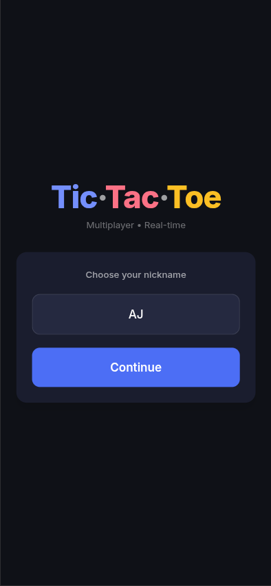
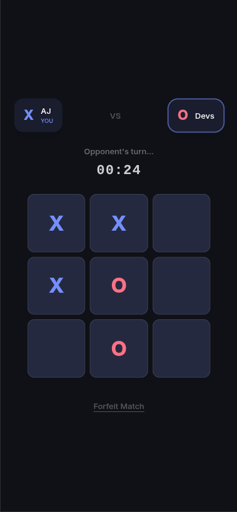
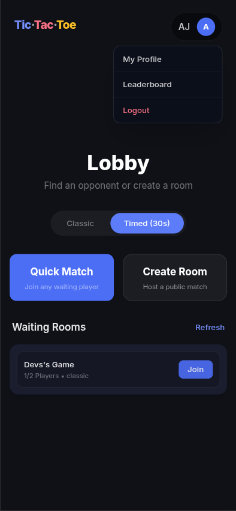
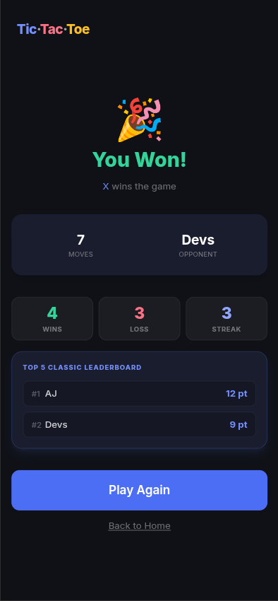
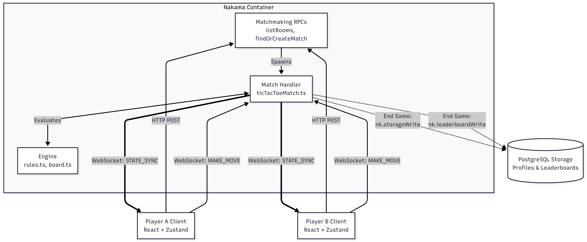

# Multiplayer Tic-Tac-Toe with Nakama




A production-ready, server-authoritative multiplayer Tic-Tac-Toe game. Built with React, TypeScript, Vite, and the Heroic Labs Nakama authoritative match server.

## Overview

This project implements a fully secure, scalable multiplayer ecosystem. Instead of clients talking directly to each other or blindly trusting local game logic, the Nakama server acts as the absolute source of truth. Clients submit moves, and the server validates them, updates the board, calculates win/loss conditions, and broadcasts the new state.

### Key Features
- **Server-Authoritative Gameplay:** Fraud-proof match validation. Clients cannot cheat.
- **Matchmaking & Lobbies:** Instant "Quick Match" functionality, plus the ability to create and join custom Public Rooms.
- **Game Modes:** 
  - *Classic:* Standard turn-based play.
  - *Timed:* A fast-paced mode where each player has 30 seconds per turn. If the timer zeroes out, the player automatically forfeits.
- **Persistent Player Profiles:** Tracks total Games Played, Wins, Losses, Draws, and Win Streaks stored securely in Nakama's NoSQL storage.
- **Global Leaderboards:** Competitive points system (Win = 3pts, Draw = 1pt). Ranks top players per mode.
- **Robust Connection Handling:** Graceful disconnects, match forfeitures, and auto-cleanup.




## Tech Stack
- **Frontend:** React, TypeScript, Vite, Tailwind CSS, Zustand, Nakama JS SDK.
- **Backend:** Nakama (Go-based server), Nakama TypeScript Runtime, PostgreSQL.
- **Infrastructure:** Docker & Docker Compose.

## Architecture Summary


The server employs the **Nakama TypeScript Runtime** API to inject custom logic into the matchmaking pool. 
- **Match Handler Lifecycle:** The server implements Nakama's `MatchProvider` interface (`matchInit`, `matchJoinAttempt`, `matchJoin`, `matchLeave`, `matchLoop`, `matchTerminate`).
- **Tick Engine:** The game runs at a fixed server tick rate (e.g. 1 tick per second), constantly evaluating state, polling timeouts, and broadcasting synchronized `STATE_SYNC` payloads to local clients.
- **Stat Persistence:** Upon match finish, the server (not the client) evaluates the result, uses `nk.storageWrite` to update profiles securely (read-only for clients), and bumps the leaderboard via `nk.leaderboardRecordWrite`.

For detailed documentation, please refer to the [Architecture Documentation](docs/ARCHITECTURE.md).

## Local Setup

### Prerequisites
- Node.js (v18+)
- Docker & Docker Compose

### 1. Start Server Infrastructure (Nakama + PostgreSQL)
```bash
cd infra
docker compose up -d
```
Nakama will be accessible at `http://localhost:7350` (API) and `http://localhost:7351` (Console - admin:password).

### 2. Build Backend Runtime Modules
The Nakama server hot-mounts logic from `/nakama/dist/`. You must compile the TypeScript backend logic for the server to recognize the rules:
```bash
cd nakama
npm install
npm run build
```
*(If you make changes to `/nakama/src`, run `npm run build` again and restart the docker container).*

### 3. Start the Frontend
```bash
cd frontend
npm install
npm run dev
```
Open `http://localhost:5173/` in your browser.

## How It Works

### Matchmaking Flow & RPCs
Players enter the lobby and can interact via 3 distinct Remote Procedure Calls (RPCs):
1. **`findOrCreateMatch` (Quick Match):** The server privately scans active matchmaking pools. If a public/quick match hasn't started, the server provisions one securely under the hood, tagging it with `visibility: 'quick'` to prevent it from cluttering the public room list.
2. **`createRoom`:** The server spins up a custom room, explicitly tagging it with `visibility: 'public'`.
3. **`listRooms` + `joinRoom`:** Public rooms are broadcast via the `listRooms` endpoint to all connected clients in the Lobby. Players then submit a join attempt via `joinRoom`, which the server validates strictly for capacity.

### Timed Mode
When a Timed match is initialized, the server tracks an internal `turnDeadline` timestamp. During the `matchLoop` tick execution, the server checks if `Date.now() > state.turnDeadline`. If true, the active player forcefully forfeits the game.

### Leaderboard / Stats
Profiles and Leaderboards are strictly protected from client manipulation. 
When the match concludes, the backend script triggers a helper function that securely modifies the Nakama Storage Collection (`stats`) using an escalated server-only write privilege. The same occurs for the global Incremental Leaderboard.

## Manual Testing Guide
1. Launch the frontend and open two separate Incognito windows side-by-side.
2. Enter two different nicknames (e.g., "Player A" and "Player B").
3. Have "Player A" click **Create Room**. 
4. Have "Player B" wait in the lobby. The room will appear dynamically (via automatic polling or manual refresh). Click **Join**.
5. Disconnect testing: Close Player A's tab mid-game. Player B's UI should immediately announce Player A forfeited via disconnect.

For detailed testing instructions, please refer to the [Testing Documentation](docs/TESTING.md).

## Deployment Overview
- **Database:** Runs cleanly inside the Docker cluster on your VPS.
- **Backend:** A Free Tier VPS on **AWS EC2** (`t2.micro`) or **GCP** (`e2-micro`). Runs Nakama & Postgres natively via `docker-compose`. Port `7350` must be exposed.
- **Secure Tunneling:** Uses `ngrok` running on the VPS to instantly wrap Nakama's port 7350 in an SSL (`https://`) tunnel. This bypasses the Mixed Content blocks imposed by modern browsers, without you needing to buy a domain name.
- **Frontend:** Deployed for free on **Vercel** or **Netlify** configured with `.env` variables pointing straight to the secure Ngrok tunnel.

For detailed deployment instructions, please refer to the [Deployment Documentation](docs/DEPLOYMENT.md).